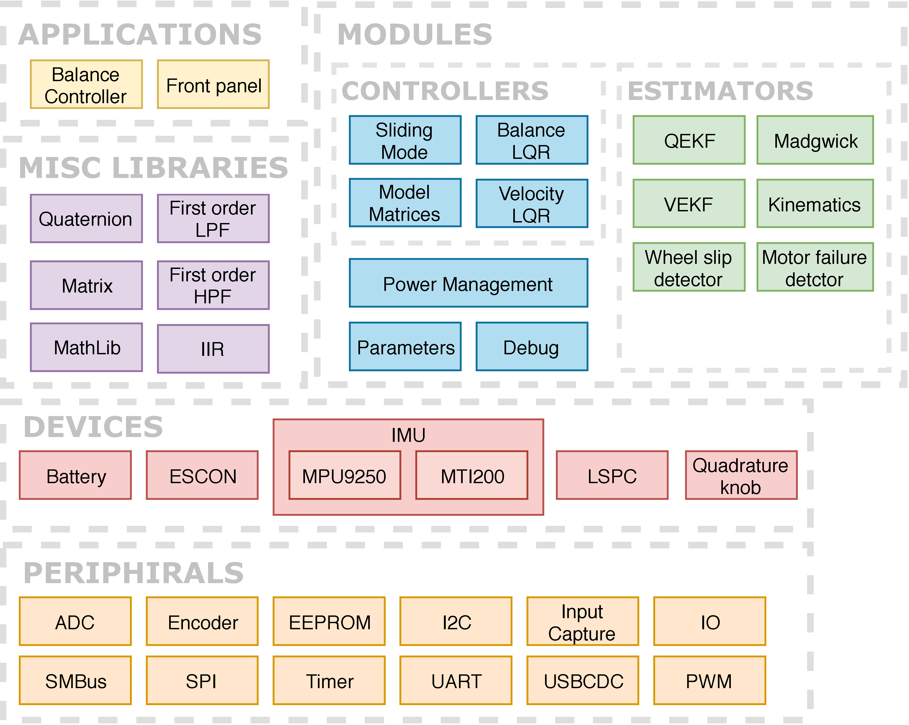
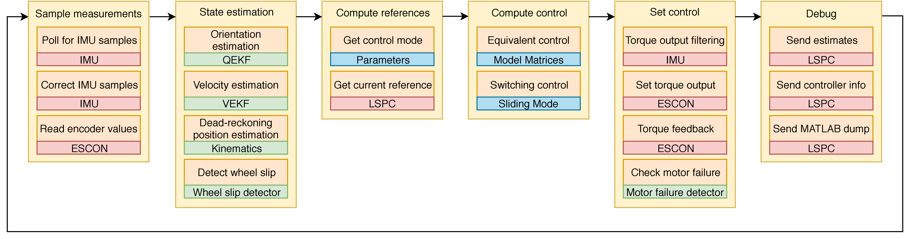

# Kugle-Embedded
This repository contains the Embedded firmware code for the STM32H7 board _([NUCLEO-H743ZI](https://www.st.com/content/st_com/en/products/evaluation-tools/product-evaluation-tools/mcu-mpu-eval-tools/stm32-mcu-mpu-eval-tools/stm32-nucleo-boards/nucleo-h743zi.html))_ on the Kugle robot developed as part of the master thesis work described in [Kugle - Modelling and Control of a Ball-balancing Robot](https://github.com/mindThomas/Kugle-MATLAB/blob/master/Kugle%20-%20Modelling%20and%20Control%20of%20a%20Ball-balancing%20Robot.pdf).

<div align="center">

</div>

The embedded firmware includes all the necessary low-level drivers and high-level application libraries such as the Sliding mode balance controller, Quaternion extended Kalman filter (QEKF) for quaternion estimation and other estimators. To a certain extent the firmware is based based on code generated by MATLAB Coder with the scripts in [Kugle-MATLAB](https://github.com/mindThomas/Kugle-MATLAB).

# Firmware structure
The Kugle V1 prototype includes a new and fast microprocessor platform for which several low-level drivers are developed to connect the microprocessor to all the external periphirals on the robot. [FreeRTOS](https://www.freertos.org/) is used on the microprocessor to enable a multi-threaded processing environment. All code for the microprocessor is implemented as C++ libraries for readability, traceability and ease of debugging, and can be found in [`Libraries`](KugleFirmware/Libraries).

The complete firmware stack shown in the figure below, has been developed from scratch, including all low-level hardware libraries, periphiral libraries, drivers, all the way up to the application layers. The choice of a multithreaded object-oriented working environment will hopefully allow future users to quickly expand the features of the embedded firmware without affecting existing applications already running.

<div align="center">

</div>

The bottom of the firmware stack, also known as the hardware layer, HAL, includes all
__[microprocessor-specific libraries](KugleFirmware/Libraries/Periphirals)__ with individual classes for each peripheral.

The __[device drivers](KugleFirmware/Libraries/Devices)__ includes all the necessary drivers for the onboard devices such as the IMU, motor drivers, batteries and the package protocol, [LSPC](https://github.com/kdhansen/LSPC), used for the USB communication. LSPC, short for _Lightweight Serial Package Communication_, is a simple protocol for serial stream interfaces enabling message passing with packages tagged with an ID. The LSPC library thus gives the embedded firmware a publish/subscribe mechanism for passing messages to and from the onboard computer. The list of LSPC message types and IDs are defined in the struct at [`Libraries/Devices/LSPC/MessageTypes.h`](KugleFirmware/Libraries/Devices/LSPC/MessageTypes.h).

Both the IMU and LSPC library is templated to allow several interface options. As an example the MPU-9250 supports both I2C and SPI communication, which has been made completely transparent with the MPU-9250 library. In general, device drivers are the only libraries with direct dependency to periphiral libraries.

The __[module libraries](KugleFirmware/Libraries/Modules)__ includes self-contained units which may or may not depend on device drivers.  
The [controller](KugleFirmware/Libraries/Modules/Controllers) and [estimator](KugleFirmware/Libraries/Modules/Estimators) libraries are all independent classes who only perform mathematical operations and possibly include some time dependent states. Some of these libraries are generated with [MATLAB Coder](https://www.mathworks.com/products/matlab-coder.html), such as the [QEKF](KugleFirmware/Libraries/Modules/Estimators/QEKF), [VEKF](KugleFirmware/Libraries/Modules/Estimators/VelocityEKF) and [model matrices](KugleFirmware/Libraries/Modules/Controllers/ModelMatrices).  
The [power management library](KugleFirmware/Libraries/Modules/PowerManagement) monitors the batteries.  
The [parameters library](KugleFirmware/Libraries/Modules/Parameters) includes a global list of dynamically modifiable parameters, thereby serving the purpose as a global parameter server. The global parameter server is linked to an LSPC object so that the parameters can be modified from the onboard computer, see [Reconfigure GUI](https://github.com/mindThomas/Kugle-ROS#reconfigure-gui-reconfigurable-parameters).  
The [debug library](KugleFirmware/Libraries/Modules/Debug) implements an overload on the `printf` function for passing `printf` messages directly to the onboard computer over USB, using a debug package, packed with LSPC.

Some __[miscellaneous support libraries](KugleFirmware/Libraries/Misc)__ are developed to make mathematical operations such as [matrix multiplication](KugleFirmware/Libraries/Misc/Matrix) and [quaternion operations](KugleFirmware/Libraries/Misc/Quaternion) easier. These math libraries are developed as plain C functions rather than classes, so that they can be called everywhere.

Finally, the __[application layer](KugleFirmware/Libraries/Applications)__ includes the main applications of the firmware. The characteristic of an application is a thread with a main loop that can be started, stopped or restarted. An application is thus very similar to a service in a Unix system. Two main applications are developed in the embedded firmware, namely the [balance controller](KugleFirmware/Libraries/Applications/BalanceController) and the [front panel](KugleFirmware/Libraries/Applications/FrontPanel).  
The [balance controller](KugleFirmware/Libraries/Applications/BalanceController) contain all the necessary logic and flow to run the controller and estimators and set the torque output accordingly, see [Balance controller](#balance-controller).   The [front panel](KugleFirmware/Libraries/Applications/FrontPanel) updates the user LEDs and monitors the buttons, e.g., handling the shutdown button which can be configured to start and stop the controller.

All libraries are developed with attention to thread-safety and thus include semaphores, mutexes, queues etc. where necessary. As an example the library for the [I2C periphiral](KugleFirmware/Libraries/Periphirals/I2C), being a bus-standard that supports multiple devices through addressing, is developed in such a way that multiple objects pointing to the same I2C periphiral, can be constructed and used independently across multiple threads.

## Feature list
Some of the features within the embedded firmware libraries include:

 - Object oriented (C++) thread-safe Low-level periprhiral libraries
 - Xsens IMU driver
 - MPU9250 IMU driver
 - ESCON motor driver
 - Quaternion math library
 - Quaternion estimator
 - Madgwick
 - Kinematics library
 - Velocity estimator
 - LQR controller
 - Sliding mode controller
 - Heading independent mode
 - Velocity LQR controller
 - Drag detection (when the robot is being dragged, thus changing the position reference)
 - Torque ramp up when starting
 - Lift detection (motor failure detector can be used for lift detection by looking at the feedback from the ESCON drivers)
 - Wheel Slip detection
 - Multi-threaded Publish/subscribe message system over USB to embedded firmware, utilizing LSPC, with callback function registration - see [API Protocol.pdf](API%20Protocol.pdf).
 - ROS driver publishing estimates, raw sensor topics etc. and subscribing to reference topics
 - ROS reconfigurable parameters for easy tuning
 - MATLAB dump functionality - logging of everything (raw measurements, estimates, covariances, control outputs etc.)
 - printf functionality working over LSPC
 - Bootloader functionality for updating the firmware over USB

## Important files and folders
 - [`main.c`](KugleFirmware/Src/main.c) includes the `main` function which configures the microprocessor clock and the FreeRTOS kernel. Only one task, `MainTask`, is created and started with the FreeRTOS operating system.
 - [`MainTask.cpp`](KugleFirmware/Src/MainTask.cpp) includes the code for the `MainTask` which is started as the first thing when the MCU boots. The sole purpose of this task is to create object instances of the different libraries and link them together with the different modules of the system. Since some of the modules creates other tasks, this process of creating all the object instances is what starts the whole system. After creating and linking the objects the `MainTask` thread goes into a monitoring mode, keeping track of the MCU load.
 - [`Libraries`](KugleFirmware/Libraries) includes sub-folders for all the libraries listed in the firmware structure drawing above.
 - [`Libraries/Periphirals`](KugleFirmware/Libraries/Periphirals) includes all custom periphiral drivers, e.g., [PWM](KugleFirmware/Libraries/Periphirals/PWM), [Encoder](KugleFirmware/Libraries/Periphirals/Encoder), and [USBCDC](KugleFirmware/Libraries/Periphirals/USBCDC).
 - [`Libraries/Devices`](KugleFirmware/Libraries/Devices) includes the individual devices drivers, e.g., [ESCON](KugleFirmware/Libraries/Devices/ESCON), [MPU9250](KugleFirmware/Libraries/Devices/MPU9250), [MTI200](KugleFirmware/Libraries/Devices/MTI200) and [LSPC](KugleFirmware/Libraries/Devices/LSPC).
 - [`Libraries/Modules/Controllers`](KugleFirmware/Libraries/Modules/Controllers) includes all the controller libraries, e.g., the [Sliding mode balance controller](KugleFirmware/Libraries/Modules/Controllers/SlidingMode) and the [Velocity LQR controller](KugleFirmware/Libraries/Modules/Controllers/VelocityLQR).
 - [`Libraries/Modules/Estimators`](KugleFirmware/Libraries/Modules/Estimators) includes all the estimator libraries, e.g., the [QEKF](KugleFirmware/Libraries/Modules/Estimators/QEKF) and [VEKF](KugleFirmware/Libraries/Modules/Estimators/VelocityEKF). 
 - [`Libraries/Modules/Parameters`](KugleFirmware/Libraries/Modules/Parameters) includes the code for the parameter library including the header file, [`Parameters.h`](KugleFirmware/Libraries/Modules/Parameters/Parameters.h), where all parameters are defined.
 - [`Libraries/Applications`](KugleFirmware/Libraries/Applications) includes all the application tasks, e.g., the [Balance controller](KugleFirmware/Libraries/Applications/BalanceController) and [Front panel handler](KugleFirmware/Libraries/Applications/FrontPanel).

# Balance controller
The firmware includes both a balance controller and a velocity controller as described in [Controller structure](https://github.com/mindThomas/Kugle-MATLAB#controller-structure). 

The main part of the firmware that ties everything together is the control loop inside the [balance controller](https://github.com/mindThomas/Kugle-Embedded/blob/1da3d5f95059f0f7a3147d7fae29ff62770ab6dc/KugleFirmware/Libraries/Applications/BalanceController/BalanceController.cpp#L318-L925). The balance controller loop runs at 200 Hz and implements a sequence of tasks shown below. The flow of the balance controller loop is depicted in six steps where the actions within each step are executed
from top to bottom. The coloured boxes indicate the main library used for each action.



The first step is to collect measurements from the different sensors. These sensor values are used in the second step for state estimation.  
In the third step the control mode is defined with a dynamic parameter. The control mode can be set to either balance control, where just the [balance controller](KugleFirmware/Libraries/Applications/BalanceController) is running, or set to velocity control, where a cascaded configuration of the [balance controller](KugleFirmware/Libraries/Applications/BalanceController) and [velocity LQR controller](KugleFirmware/Libraries/Modules/Controllers/VelocityLQR). Note that in velocity control mode the velocity controller runs in the same loop just prior to computing the sliding mode control.
Different type of references for the controllers can be sent over USB through LSPC and are automatically parsed in the control loop.  
The fourth step involves computing the control. The depicted actions illustrate the sliding mode balance controller which consists of first computed an equivalent control part following by a switching part.  
Finally, the computed control torque is sent to the ESCON motor drivers and a torque feedback is used to detect motor failures and lift.  
As a last step several debug informations are queued for transmission to the onboard computer for ROS topic transmission and logging in general, including a large float array with a raw dump of everything to be processed in MATLAB.

The exact sequence of steps is listed below.
 1. Refresh parameters from internal parameter "server"
 2. Get measurements from IMU (polling mode)
 3. Correct measurements based on IMU calibration (accelerometer bias, accelerometer scale, gyroscope bias, rotation alignment/COM alignment)
 4. Read encoder values - utilizing processor timer capability of quadrature decoding
 5. Send raw sensor values to PC
 6. Estimate orientation using Madgwick or QEKF
 7. Compute kinematics-based velocity
 8. Integrate kinematics-based velocity to get dead-reckoning-based position estimate (odometry)
 9. Estimate velocity using Velocity EKF
 10. Send estimates to PC
 11. Extract/compute references based on control mode and setpoints  (Quaternion control vs Velocity control)
 12. Run wheel slip detector on new encoder values
 13. Run controller (LQR or Sliding mode, depending on controller selection)
 14. Saturate torque output based on configurable limits
 15. Perform torque ramp up step, if the controller was just started
 16. Set motor output torque
 17. Read motor feedback torque
 18. Run motor failure detector on output torque and feedback torque (for lift detection)
 19. Send controller info, debug and statistics to PC
 20. Send MATLAB dump messages
 
 


# Developer notes
## Important notes
* When creating objects of classes of larger size, use "new" to allocate the memory for the object in heap instead of on the stack
  * Example of how to do this with the object as a pointer: `MPU9250 * imu = new MPU9250(spi);`
  * Example of how to do this while keeping the object as a reference (instead of a pointer) is: `MPU9250& imu = *(new MPU9250(spi));`

## IDE
System Workbench, an IDE based on Eclipse, has been used as the development environment for this embedded firmware. System Workbench is a cross-platform compatible IDE based on Eclipse bundled with both libraries for STM32 devices, GDB debugger and ST-Link debugging capability, enabling easy programming and debugging of embedded applications for STM32 devices.

The IDE can be downloaded from http://www.openstm32.org

### Debugging on Ubuntu
If you get an error similar to _Could not determine GDB version using command_ then you might have installed the 64-bit version of System Workbench. However the bundled GDB debugger is a 32-bit version based on the Linaro releases, why you will have to install the corresponding 32-bit version of _ncurses_.

```bash
sudo apt-get install lib32ncurses5
```


## DFU bootloader (over USB)
Activative the DFU bootloader through the firmware by calling the `Enter_DFU_Bootloader` function.

### Firmware update
Now a new firmware can be loaded into the board using the `dfu-util` tool from http://dfu-util.sourceforge.net/dfuse.html

```bash
./dfu-util -a 0 -s 0x08000000:leave -D KugleFirmware.bin
```

The current firmware (reading the whole flash) can also be retrieved from the board using

```bash
./dfu-util -a 0 -s 0x08000000:2097152 -U read.bin
```

OBS. If you receive a permission error you can either run the command as root (`sudo ...`) or you can install the udev rule.

To reset the board out of DFU the `dfu-tool` built in to Linux can be used

```bash
./ResetDFUfromCommandline.sh
```

## Updating firmware with onboard programmer/debugger
Instead of using the IDE for programming the firmware, the flash can be erased and programmed through terminal.

### Erase flash
The flash can be erased by using the `EraseFlashFromCommandline.sh` script after modifying the `OPENOCD_PATH` and `OPENOCD_SCRIPTS_PATH` accordingly.
```bash
./EraseFlashFromCommandline.sh
```

### Reset/reboot firmware
The currently running firmware can be restarted through the onboard programmer by calling:
```bash
./ResetFromCommandline.sh
```
